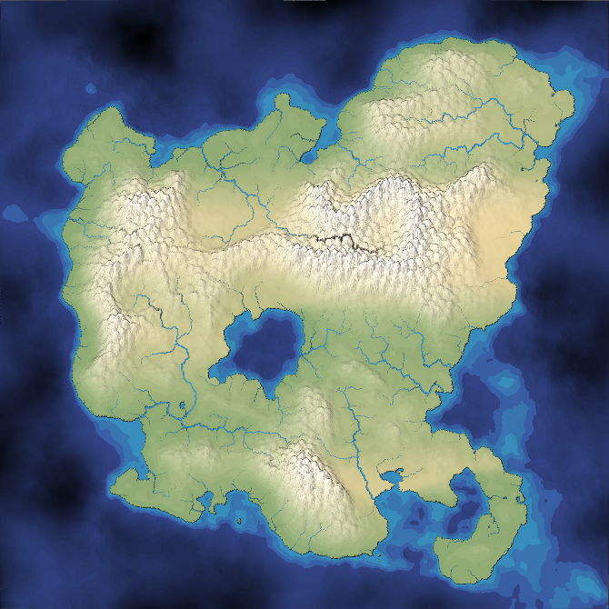

# Mapgen4

Paint a map and watch it come to life. Mapgen4 is a procedural wilderness map generator that runs in the browser: draw ocean, valleys, mountains and deserts, and the terrain, rivers, rainfall and biomes regenerate in real time.



Built on [mapgen4](https://github.com/redblobgames/mapgen4) by Amit Patel of [Red Blob Games](https://www.redblobgames.com/maps/mapgen4/). The generator and renderer are his work; this version adds extra brushes and export tools. Written in TypeScript, rendered with WebGL2, with the map calculations running in a web worker.

## Features

- **Real-time painting** with ocean, water, valley, mountain and desert brushes in four sizes
- **Tunable look** with sliders for island shape, noise, mountain height, rainfall, wind, rivers, lighting, tilt, outlines and more
- **Save and load projects** as JSON (sliders and painting)
- **PNG export** of the whole map, top-down
- **Overlay image** to show a reference picture over the map while you paint
- **Batch from image** to turn a greyscale picture into a grid of generated tiles, stitched into one PNG
- **Quality settings** for render resolution and cell density, to match your GPU

## Quick start

You need [Node.js](https://nodejs.org/), [esbuild](https://esbuild.github.io/), and a browser with WebGL2.

```sh
npm install -g esbuild
npm install
./build.sh
python3 -m http.server 8000
```

Open <http://localhost:8000/embed.html>.

`build/` isn't checked in, so run `./build.sh` after cloning and again after changing any `.ts` file or `config.js`. Any static file server works; the page must be served over HTTP because it loads a web worker and a data file.

> **Performance:** the default is about 190,000 regions rendered at 4096×4096, which wants a capable GPU and takes a few seconds to load. If it's slow, lower **Cell density** and **Resolution** (see [Quality settings](#quality-settings)).

## Using it

### Painting

Pick a brush size and a terrain, then click and drag on the map. Keyboard shortcuts:

- **Brush size:** `1` tiny, `2` small, `3` medium, `4` large
- **Terrain:** `Q` ocean, `W` water, `E` valley, `R` mountain, `T` desert

Tips:

- Hold **Shift** to paint slowly (a quarter of the normal rate).
- **Desert** raises land slightly and forces the area dry, so it becomes desert instead of picking up rainfall.
- The **Brush size** and **Brush strength** sliders scale every brush.
- Painting locks the **seed** and **island** sliders so they don't overwrite your work. **Reset** clears your painting and unlocks them.

### Moving around

- **Mouse wheel** zooms around the cursor.
- **Right-click and drag** pans.
- The `zoom`, `x` and `y` sliders do the same thing.

### Saving and exporting

- **Save project** downloads a JSON file with your sliders, painting, cell density and resolution.
- **Load project** restores one. If it used a different density or resolution, the page reloads with those settings.
- **Download PNG** renders the whole map top-down and saves it as `mapgen4-<seed>.png`.
- **Add overlay** shows an image over the map. Clicks pass through, so you can still paint, which is handy for tracing. **Overlay opacity** controls how strongly it shows, and **Remove overlay** hides it.

### Batch from image

Generate a large map from a rough sketch.

1. Under **Batch from image**, click **Select image…** and choose a picture.
2. Set the grid size as columns × rows (1 to 8 each). The image is cut into that many tiles.
3. Click **Generate & Download**.

Each tile is shrunk to 128×128 and its brightness becomes elevation: black is deep ocean, mid grey is sea level, white is mountain. Every tile is generated and rendered at full resolution, then all of them are stitched into `map-tiles-<cols>x<rows>.png`.

> Batch generation replaces whatever you had painted. Save your project first if you want to keep it.

### Quality settings

Both menus reload the page and carry your painting and sliders over.

- **Resolution** is the size of the render textures: Low (512), Med (1024), High (2048), or Ultra (4096, the default).
- **Cell density** is the spacing between mesh points, so a smaller number means more, smaller cells: Dense (1), Normal (2, the default), Sparse (4), or Very sparse (8).

You can also set them in the URL: `embed.html?res=2048&spacing=4`.

## Configuration

[`config.js`](config.js) holds the mesh settings:

- `spacing`: default cell spacing (2.0). Smaller values give more cells.
- `mountainSpacing`: spacing of mountain peaks.
- `mesh.seed`: seed for point placement.

`./build.sh` pre-generates the points for the default spacing into `build/points-<spacing>-<width>x<height>.data`, so run it again after changing `spacing`. Other spacings (from the **Cell density** menu or `?spacing=`) are generated in the browser instead.

The upstream project can handle 1 million+ cells (try a spacing of 0.7), including [a very detailed river network](https://www.redblobgames.com/maps/mapgen4/blog/3565944-triangles-600kregions.png). Its rendering parameters were tuned to look best around 25,000 cells, which is roughly **Sparse** to **Very sparse** here.

The mesh, map and renderer code supports non-square worlds (`mapWidth` and `mapHeight`). The page currently uses a 1000×1000 world, and points files are also pre-generated for 2000×1000.

## Code

The entry point is [`mapgen4.ts`](mapgen4.ts), which wires up the UI, project files, export and batch generation.

- [`map.ts`](map.ts): elevation, rainfall, biomes and rivers
- [`painting.ts`](painting.ts): brushes, painting input, and the elevation and moisture constraint grids
- [`render.ts`](render.ts): WebGL2 rendering, including the oblique projection and outlines
- [`worker.ts`](worker.ts): runs the map calculations off the main thread
- [`mesh.ts`](mesh.ts): builds the Delaunay/Voronoi mesh from the point set
- [`generate-points.ts`](generate-points.ts): Poisson-disc point placement
- [`generate-points-file.ts`](generate-points-file.ts): build step that writes the pre-generated points files
- [`geometry.ts`](geometry.ts): calculations shared by the worker and the renderer
- [`dual-mesh/`](dual-mesh/): the triangle mesh data structure

Although the code is TypeScript, esbuild does *not* check types. Type checking happens in the editor only.

## Background

<details>
<summary>Amit Patel's blog posts on how the original generator works</summary>

- [History](http://simblob.blogspot.com/2018/08/mapgen4-goals.html) of the project
- [Alternative to Voronoi cells](https://www.redblobgames.com/x/1721-voronoi-alternative/)
- [Compact data structure](https://www.redblobgames.com/x/1722-b-rep-triangle-meshes/) for the Delaunay+Voronoi mesh
- [Elevation](http://simblob.blogspot.com/2018/08/mapgen4-elevation.html) to match the desired look instead of tweaking the look to match the elevation
- [Distance fields for elevation](http://simblob.blogspot.com/2018/09/mapgen4-elevation-painting.html)
- [Multithreading](http://simblob.blogspot.com/2018/09/mapgen4-threads.html) to make it run acceptably fast
- Fixing the [appearance of rivers](http://simblob.blogspot.com/2018/09/mapgen4-river-appearance.html)
- Revisiting [distance fields](http://simblob.blogspot.com/2018/09/mapgen4-elevation-painting-revisited.html), which didn't work out like he hoped
- [Rainfall](http://simblob.blogspot.com/2018/09/mapgen4-rainfall.html), biomes, evaporation, wind
- Rendering with an [oblique projection](http://simblob.blogspot.com/2018/09/mapgen4-oblique-projection.html), not the standard rotate+translate+scale
- Rendering [outlines](http://simblob.blogspot.com/2018/10/mapgen4-outlines.html)
- Some [bug fixes](http://simblob.blogspot.com/2018/09/mapgen4-bug-fixes.html)
- River [generation](https://www.redblobgames.com/x/1723-procedural-river-growing/) and [data structures](http://simblob.blogspot.com/2018/10/mapgen4-river-representation.html)

It's a continuation of ideas from [mapgen2](https://github.com/amitp/mapgen2/) (2010), at a much larger scale.

</details>

## License

Mapgen4 and the helper libraries it includes (dual-mesh, prng) are licensed under Apache v2. See [LICENSE](LICENSE). You can use this code in your own project, including commercial projects.

It uses these libraries:

- [Delaunator](https://github.com/mapbox/delaunator.git) from MapBox, ISC license
- [fast-2d-poisson-disk-sampling](https://github.com/kchapelier/fast-2d-poisson-disk-sampling) from Kevin Chapelier, MIT license
- [simplex-noise](https://github.com/jwagner/simplex-noise.js) from Jonas Wagner, MIT license
- [flatqueue](https://github.com/mourner/flatqueue) from Vladimir Agafonkin, ISC license
- [gl-matrix](https://github.com/toji/gl-matrix) from Brandon Jones and Colin MacKenzie IV, MIT license
- [esbuild](https://esbuild.github.io/) from Evan Wallace, MIT license (build step only)
